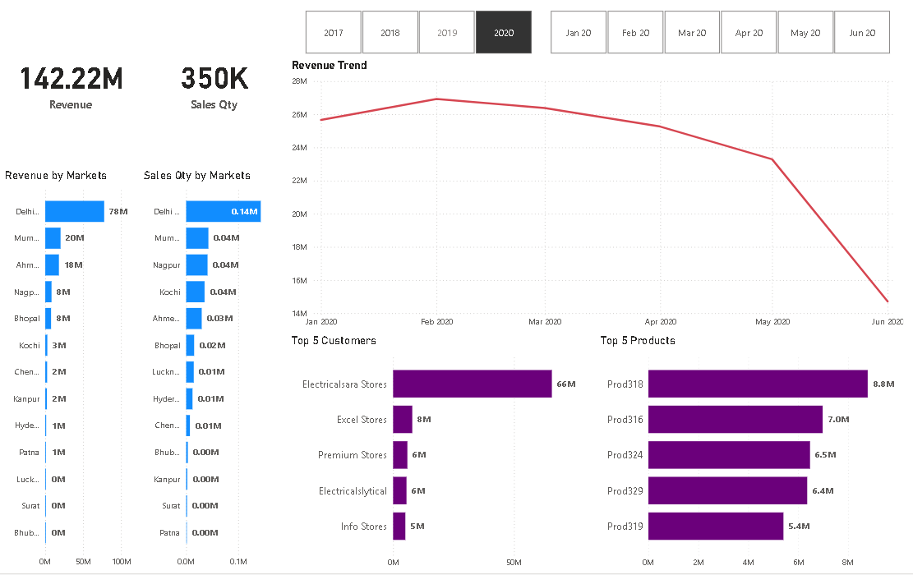

## Sales Insights Data Analysis Project

Demo Link: https://app.powerbi.com/links/oi1E_myi2m?ctid=457a287e-c649-4355-817e-30f728e578d8&pbi_source=linkShare

### Instructions to setup mysql on your local computer

1. Install mysql on your local computer

1. SQL database dump is in db_dump.sql file above. Download `db_dump.sql` file to your local computer and import it as per instructions.

### Data Analysis Using SQL

1. Show all customer records

    `SELECT * FROM customers;`

1. Show total number of customers

    `SELECT count(*) FROM customers;`

1. Show transactions for Chennai market (market code for chennai is Mark001

    `SELECT * FROM transactions where market_code='Mark001';`

1. Show distrinct product codes that were sold in chennai

    `SELECT distinct product_code FROM transactions where market_code='Mark001';`

1. Show transactions where currency is US dollars

    `SELECT * from transactions where currency="USD"`

1. Show transactions in 2020 join by date table

    `SELECT transactions.*, date.* FROM transactions INNER JOIN date ON transactions.order_date=date.date where date.year=2020;`

1. Show total revenue in year 2020,

    `SELECT SUM(transactions.sales_amount) FROM transactions INNER JOIN date ON transactions.order_date=date.date where date.year=2020 and transactions.currency="INR\r" or transactions.currency="USD\r";`
	
1. Show total revenue in year 2020, January Month,

    `SELECT SUM(transactions.sales_amount) FROM transactions INNER JOIN date ON transactions.order_date=date.date where date.year=2020 and and date.month_name="January" and (transactions.currency="INR\r" or transactions.currency="USD\r");`

1. Show total revenue in year 2020 in Chennai

    `SELECT SUM(transactions.sales_amount) FROM transactions INNER JOIN date ON transactions.order_date=date.date where date.year=2020
and transactions.market_code="Mark001";`

Data Analysis Using Power BI
============================

1. Formula to create norm_amount column

`= Table.AddColumn(#"Filtered Rows", "norm_amount", each if [currency] = "USD" or [currency] ="USD#(cr)" then [sales_amount]*75 else [sales_amount], type any)`
